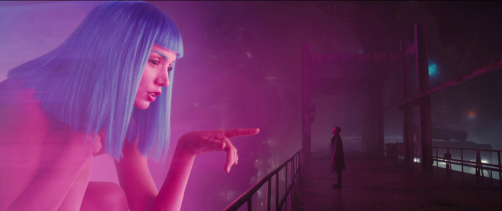
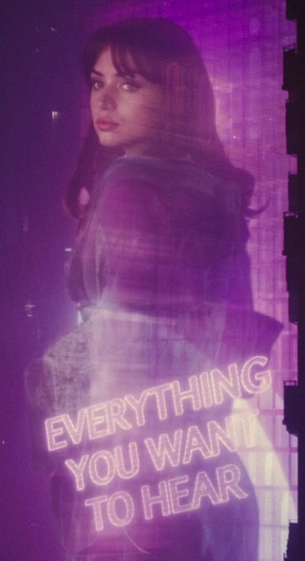
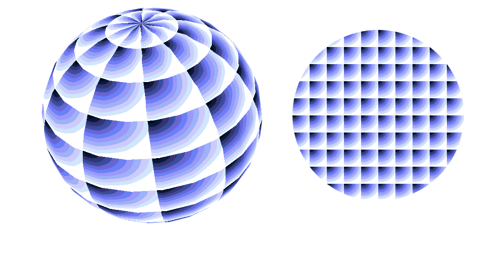

# Quiz8

## Part 1: Imaging Technique Inspiration

### Inspiration: Holographic imaging technology

The holographic imaging technology in the movie "Blade Runner 2049" is impressive, especially the presentation of the virtual character Joi. This technique of integrating digital images with the real environment creates a highly futuristic visual experience. I hope to create an effect that combines the virtual and the real through this mode that combines image transparency and blending, in order to enhance the immersion and technological sense of the work.

### Example

## Part 2: Coding Technique Exploration

### The Shader application in p5.js

The shader() function in p5.js allows you to apply custom shaders in WebGL mode, enabling complex image manipulation effects such as image overlayings, transparency controls, and dynamic visual effects. Using shader(), I can fuse multiple layers of images together to simulate a hologram like visual effect, thus achieving the image technique inspiration mentioned in Part 1.

### 示例代码截图

### 示例代码链接

- [Shader Example code](https://p5js.org/examples/advanced-canvas-rendering-shader-as-a-texture/)

---

